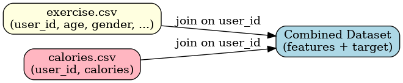
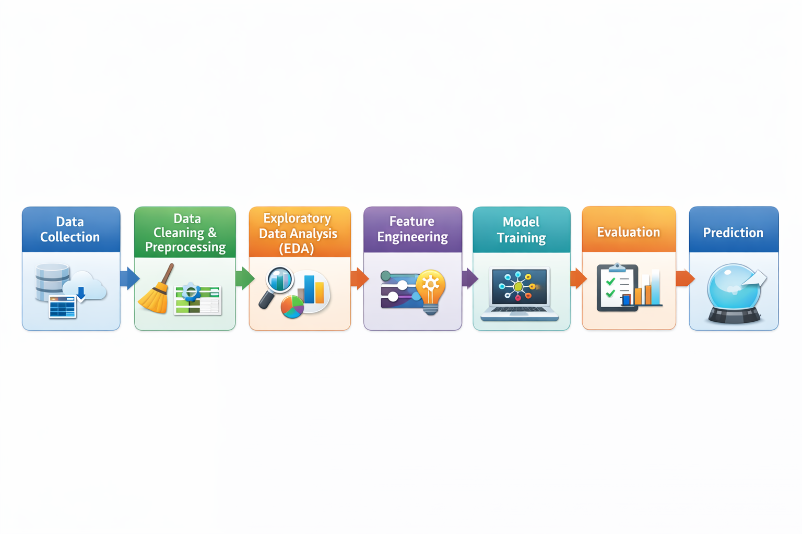
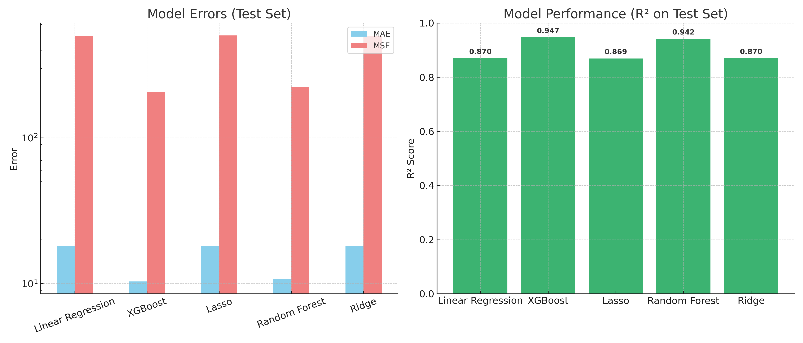

# Calories Burnt Prediction

Machine learning regression pipeline comparing five algorithms to predict exercise calorie expenditure across 15,000 workout sessions, achieving R² = 0.9990 and MAE = 1.38 kcal with XGBoost.

---

## Project Overview

Fitness trackers estimate calorie burn — but how accurate are they, and which features actually drive the prediction? This project builds and compares five regression models to predict calories burned during exercise based on physiological and activity data. The goal is to find the most accurate and generalisable model, and to surface the overfitting risks that arise when choosing between tree-based approaches.

With XGBoost predicting within ~1.4 calories on average (R² = 0.9990), the model is accurate enough to power real-time feedback loops in wearables applications or personalised health coaching platforms.

---

## Live Demo

Try the deployed app here: <a href="https://samadzaheer-calories-burnt.streamlit.app" target="_blank">Calories Burnt Predictor</a>

Adjust your personal stats and workout parameters — the model predicts your calorie burn in real time.

---

## Dataset

- **Source:** Combined exercise + calories datasets (Kaggle)
- **Size:** ~15,000 workout sessions
- **Files:** `exercise.csv` (activity and physiological features), `calories.csv` (calorie labels)

| Feature | Description |
|---------|-------------|
| Age, Gender | Demographic features |
| Height, Weight | Body composition |
| Duration | Session length in minutes |
| Heart_Rate | Average heart rate during session |
| Body_Temp | Body temperature during exercise |
| Calories | Target variable — calories burnt |

<p align="center">
  
</p>

---

## Approach

1. **Data loading & merging** — combined `exercise.csv` and `calories.csv` on session ID
2. **EDA** — checked for missing values and duplicates; correlation analysis between features and calorie burn; visualised distributions across activities and demographics
3. **Model training** — trained five regression models:
   - Linear Regression
   - Lasso Regression
   - Ridge Regression
   - Random Forest Regressor
   - XGBoost Regressor
4. **Evaluation** — compared using MAE, MSE, and R² on both train and test sets to detect overfitting

<p align="center">
  
</p>

---

## Key Findings

| Model | Train R² | Test R² | Test MAE |
|-------|----------|---------|----------|
| Linear Regression | 0.9670 | 0.9688 | 8.20 |
| Lasso | 0.9611 | 0.9626 | 9.00 |
| Ridge | 0.9670 | 0.9688 | 8.20 |
| Random Forest | 0.9997 | 0.9982 | 1.69 |
| **XGBoost** | **0.9996** | **0.9990** | **1.38** |

<p align="center">
  
</p>

- **XGBoost is the best overall model** — Test R² = 0.9990, MAE ≈ 1.38 calories. Predicts calorie burn to within ~1.4 calories on average
- **Random Forest shows clear overfitting** — train R² = 0.9997 vs test R² = 0.9982; the gap signals the model has memorised training patterns rather than generalising
- **Linear models underfit** — R² ≈ 0.97 across Linear, Lasso, and Ridge, indicating non-linear relationships in the features that trees capture and linear models cannot
- **Weight, Duration, and Heart Rate are the strongest predictors** — all 7 physiological and activity features contribute meaningfully to model accuracy
- An MAE of ~1.38 calories is accurate enough for real-time feedback in wearables or health coaching platforms

---

## How to Run

```bash
git clone https://github.com/SamadZaheer/Calories-Burnt-Prediction.git
cd Calories-Burnt-Prediction
pip install -r requirements.txt
jupyter notebook "Calories Burnt Prediction.ipynb"
```

---

## Tech Stack

- **Language:** Python
- **Libraries:** pandas, numpy, matplotlib, seaborn, scikit-learn, xgboost
- **Deployment:** Streamlit Community Cloud

---

## Author

**Samad Zaheer** — Master of Information Technology (Data Science), Queensland University of Technology (QUT)
