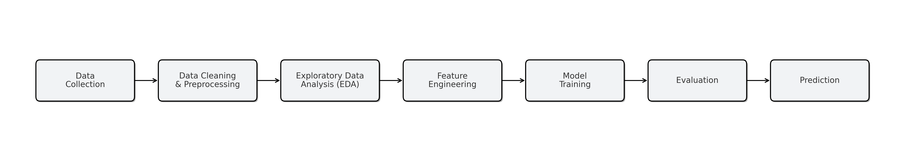

# 🏋️ Calories Burnt Prediction

This project predicts the **calories burnt during exercise** based on user activity data. Using machine learning techniques, it leverages exercise and physiological features to build a predictive model that can estimate calories burnt during workouts.  

---

## 📌 Project Workflow

The following workflow outlines the key steps in the project:  

  

---

## 📂 Files in the Repository  

- **`Calories Burnt Prediction.ipynb`** → Jupyter Notebook with complete data analysis, model training, and evaluation.  
- **`calories.csv`** → Dataset with calorie information.  
- **`exercise.csv`** → Dataset with exercise details.  
- **`README.md`** → Project documentation.  
- **`images/`** → Diagrams and charts used in the documentation.  

---

## 🚀 Tech Stack  

- **Language**: Python  
- **Libraries Used**:  
  - `numpy`, `pandas` → Data manipulation  
  - `matplotlib`, `seaborn` → Visualization  
  - `scikit-learn` → Machine learning models & evaluation  
  - `xgboost` → Advanced gradient boosting  

---

## 🔎 Exploratory Data Analysis  

The project combines **exercise** and **calories** datasets:  

  

EDA included:  
- Checking for missing values and duplicates.  
- Correlation analysis between features and calories burnt.  
- Visualizing calorie distribution across activities and demographics.  

---

## 🤖 Model Training & Evaluation  

- Models trained:  
  - Linear Regression  
  - Random Forest Regressor  
  - XGBoost Regressor  
  - Lasso Regression  
  - Ridge Regression  

- Metrics used for evaluation:  
  - **Mean Absolute Error (MAE)**  
  - **Mean Squared Error (MSE)**  
  - **R² Score**  

---

## 📊 Results  

  

| Model              | Train MAE | Train MSE | Train R² | Test MAE | Test MSE | Test R² |
|--------------------|-----------|-----------|----------|----------|----------|---------|
| Linear Regression  | 17.92     | 508.01    | 0.870    | 17.99    | 502.50   | 0.870   |
| XGBoost            | 7.75      | 117.12    | 0.970    | 10.33    | 205.67   | 0.947   |
| Lasso              | 17.94     | 511.08    | 0.869    | 18.01    | 505.08   | 0.869   |
| Random Forest      | 3.95      | 31.44     | 0.992    | 10.67    | 222.80   | 0.942   |
| Ridge              | 17.92     | 508.01    | 0.870    | 17.99    | 502.50   | 0.870   |

---

## ✅ Future Improvements  

- Add deep learning models (e.g., Neural Networks).  
- Deploy the model with **Flask** or **Django** as a web app.  
- Build a **real-time calorie prediction dashboard** for end users.  